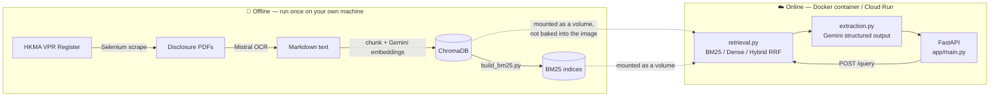

# HKMA Pillar 3 RAG Extraction Service

A production FastAPI service that answers natural-language questions about
Hong Kong banks' Basel Pillar 3 regulatory disclosures — retrieving the
relevant passage from a bank's disclosure PDF and extracting the exact
figure, unit, and applicability with a structured, LLM-backed pipeline.

This is the productionized, deployable companion to
[**FYP-RAG-Extraction**](https://github.com/applehead04/FYP-RAG-Extraction),
which contains the original research notebooks, evaluation results, and
error-analysis behind this pipeline. That repo answers *"does this retrieval
approach work, and how well?"*; this one answers *"can it run as a real,
callable service?"*

**Want to see it working right now, with zero setup?** → Try the [live demo](#try-it-live).

## Overview

Basel Pillar 3 disclosures are published as dense, inconsistently-formatted
PDFs. Instead of manually searching through them, this service lets you ask
for a specific line item (e.g. *"Tier 1 capital for AIRSTAR BANK, KM1
template, March 2025"*) and get back a structured answer with the source
text it was drawn from — so an answer can always be traced back and
verified, not just trusted.

## Architecture



The split matters: everything in **Offline** runs occasionally, needs paid
API keys (Mistral, Google) and heavy dependencies (Selenium, OCR SDKs), and
*produces* data. Everything in **Online** runs continuously, is lightweight,
and only *reads* the data that Offline already produced.

## Key Features

- **Three retrieval strategies** compared and selectable per request: BM25
  (sparse), dense vector search (ChromaDB, cosine/HNSW), and hybrid
  Reciprocal Rank Fusion.
- **Structured LLM extraction** with a Pydantic-enforced schema, including
  an `is_applicable` flag that explicitly distinguishes *"value is
  genuinely zero"* from *"this line item doesn't apply"* — a distinction
  disclosures blur but that matters for correctness.
- **Offline/online split**: heavy dependencies and data never enter the
  Docker image, keeping the deployed service small and reproducible.
- **Idempotent ingestion**: re-running ingestion for a bank atomically
  replaces its chunks rather than duplicating them.
- **Cloud-ready**: deployed and verified on Google Cloud Run, backed by a
  Cloud Storage-mounted vector store.

## Try it live

```
https://pillar3-rag-722188750879.asia-northeast1.run.app/docs
```

Open that link, expand `POST /query`, click **"Try it out"**, and submit a
request — no local setup required. Example request body:

```json
{
  "bank_name": "AIRSTAR BANK LIMITED",
  "item": "Tier 1",
  "template": "KM1",
  "year": "2025 Mar",
  "strategy": "hybrid_rrf"
}
```

## Running it yourself

This section assumes no prior familiarity with the project — each step says
what it does and why, not just what to type.

### Prerequisites

- [Docker Desktop](https://www.docker.com/products/docker-desktop/) —
  installed and running (check with `docker version` in a terminal; if that
  fails, Docker Desktop isn't open yet).
- A **Mistral API key** (used for OCR during ingestion) — get one at
  [console.mistral.ai](https://console.mistral.ai/).
- A **Google API key** (used for Gemini embeddings and extraction) — get one
  at [aistudio.google.com](https://aistudio.google.com/apikey).
- Python 3.12+ only if you want to run ingestion/evaluation directly on your
  machine rather than via Docker (the online service itself doesn't need a
  local Python install — it runs inside the container).

### Step 1 — Clone the repo

```bash
git clone https://github.com/applehead04/RAG-Extraction-Production.git
cd RAG-Extraction-Production
```

### Step 2 — Add your API keys

Copy the example environment file and fill in the two keys you got above:

```bash
cp .env.example .env
```

Open `.env` in any text editor and replace the placeholder values with your
real keys. This file is git-ignored on purpose — your keys never get
committed.

### Step 3 — Get some data into the vector store

**This is the step that trips people up**, so it's worth being explicit:
`chroma_db/` and `bm25_index/` (the vector store and sparse index) are
*not* included in this repo — see [Architecture](#architecture) above for
why. There are two ways to get data:

- **Use the live demo instead** (see [above](#try-it-live)) if you just want
  to see the service respond — no ingestion needed.
- **Run ingestion yourself** if you want your own data (this calls paid
  OCR/embedding APIs and takes a while):

  ```bash
  python -m venv .venv && source .venv/bin/activate
  pip install -r requirements-offline.txt

  python scripts/ingest.py --ground-truth ground_truth.xlsx --links ov1_link.xlsx
  python scripts/build_bm25.py
  ```

  `ground_truth.xlsx` and `ov1_link.xlsx` are the research fixtures from the
  companion dissertation repo (which banks to fetch, and the expected
  values used for evaluation) — they aren't included here since they're
  research data, not application code. Adapt `scripts/ingest.py` if you want
  to point it at different source documents entirely.

### Step 4 — Build and run the container

```bash
docker build -t pillar3-rag .
```

This reads the `Dockerfile`, installs dependencies, and copies in `app/`
(only the API code — `scripts/` deliberately isn't part of the image; see
Architecture above). It does **not** need `chroma_db/`/`bm25_index/` to
exist yet — those get attached at *run* time, next:

```bash
docker run -p 8000:8000 --env-file .env \
  -v "$(pwd)/chroma_db:/srv/chroma_db" \
  -v "$(pwd)/bm25_index:/srv/bm25_index" \
  pillar3-rag
```

The `-v` flags mount your local `chroma_db/`/`bm25_index/` folders (produced
in Step 3) into the running container. If you skipped Step 3, the container
will still start, but `/query` will return `404` since no bank has been
ingested yet — `/health` will still work and report `total_chunks: 0`.

### Step 5 — Query it

```bash
curl -X POST http://localhost:8000/query \
  -H "Content-Type: application/json" \
  -d '{
        "bank_name": "AIRSTAR BANK LIMITED",
        "item": "Tier 1",
        "template": "KM1",
        "year": "2025 Mar",
        "strategy": "hybrid_rrf"
      }'
```

Or open `http://localhost:8000/docs` in a browser for the same interactive
UI as the [live demo](#try-it-live).

### Step 6 — Evaluate (optional, offline)

```bash
python scripts/evaluate.py --ground-truth ground_truth.xlsx --workers 8
```

Outputs `Extraction_Results_<strategy>.xlsx` per strategy with per-query
correctness flags and RAGAS scores (context precision, context recall,
faithfulness, response relevancy).

## Deploying to Cloud Run

The container reads `$PORT` if the platform injects one, so no manual
`--port` flag is needed on Cloud Run.

```bash
# Build for linux/amd64 — required if you're on Apple Silicon, since Cloud
# Run's infrastructure is amd64 and a locally-built arm64 image will be
# rejected. --provenance=false --sbom=false avoid a multi-manifest image
# index that has caused Cloud Run to fail resolving the actual image layers.
docker buildx build --platform linux/amd64 --provenance=false --sbom=false \
  -t <region>-docker.pkg.dev/<project>/<repo>/pillar3-rag:latest --push .

# chroma_db/ and bm25_index/ aren't baked into the image (see Architecture
# above) — upload them to a bucket and mount it as a volume at deploy time.
gcloud storage cp -r chroma_db bm25_index gs://<bucket>/

gcloud run deploy pillar3-rag \
  --image=<region>-docker.pkg.dev/<project>/<repo>/pillar3-rag:latest \
  --region=<region> --allow-unauthenticated --execution-environment=gen2 \
  --max-instances=2 \
  --add-volume=name=data,type=cloud-storage,bucket=<bucket> \
  --add-volume-mount=volume=data,mount-path=/data \
  --set-env-vars="GOOGLE_API_KEY=...,CHROMA_DIR=/data/chroma_db,BM25_DIR=/data/bm25_index,CHROMA_COLLECTION=pillar3_disclosures"
```

`--max-instances` caps how many container instances can run concurrently —
worth setting explicitly on a public, unauthenticated endpoint so a traffic
spike (or abuse) has a bounded cost ceiling rather than scaling unchecked.

**If you're changing volume/mount configuration on an existing service and
hit a confusing state** (e.g. `ModuleNotFoundError: No module named 'app'`
despite the image being fine, or a "volumes ... not found" error):
`gcloud run deploy` merges new flags into the existing service spec rather
than replacing it outright, so stale volume config from an earlier deploy
can silently persist. Delete the service and redeploy clean rather than
trying to patch it further:

```bash
gcloud run services delete pillar3-rag --region=<region>
# then re-run the gcloud run deploy command above
```

## Error Handling

| Status | Meaning |
|--------|---------|
| `404`  | Bank not ingested, or no relevant chunks retrieved |
| `409`  | BM25 index missing (sparse/hybrid requested before `build_bm25.py`) |
| `502`  | LLM extraction failed after retries |

## Project Structure

| Path | Role | Ships in Docker image |
|------|------|:---:|
| `app/config.py` | Env, logging, cached client factories | ✅ |
| `app/schemas.py` | LLM output schema + API contracts | ✅ |
| `app/retrieval.py` | BM25 / dense / hybrid RRF search | ✅ |
| `app/extraction.py` | Structured LLM extraction + cache | ✅ |
| `app/main.py` | FastAPI endpoints | ✅ |
| `scripts/ingest.py` | Scrape → OCR → embed → ChromaDB | ❌ |
| `scripts/build_bm25.py` | Per-bank BM25 index builder | ❌ |
| `scripts/evaluate.py` | RAGAS + ground-truth evaluation | ❌ |

## Related

- [**FYP-RAG-Extraction**](https://github.com/applehead04/FYP-RAG-Extraction) —
  the dissertation research repo: notebooks, retrieval-strategy benchmarking,
  RAGAS evaluation, and the eight-category error taxonomy this service's
  design decisions are based on.
